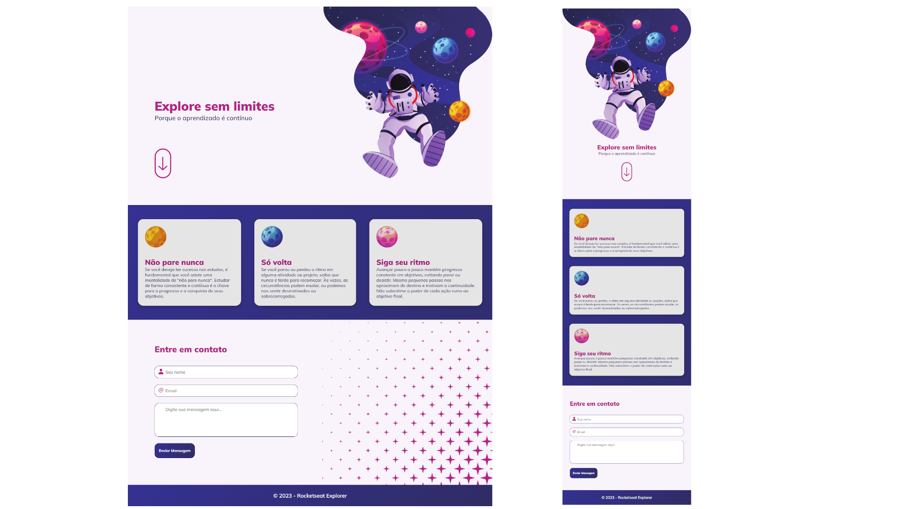

# explorer-explorer-sem-limites
 Página explorer sem limites para revisar os conceitos dos stage 1 ao 4 

  

## 🖥️ Projeto
Projeto desenvolvido no intensivão da rocketseat, para revisar conceitos básicos de html e css. Foram utilizados animações, media queries, transformações, transições, variáveis css, validação de formulário dentre outros.

## 🚀 Tecnologias
Foi desenvolvido esse projeto com as seguintes tecnologias:

- HTML
- CSS
- FIGMA
- GIT
- GITHUB

## 👀 Ver
Aqui você pode visualizar o layout do projeto:
<a href="https://www.figma.com/file/Jvp6mtcui6kugI4CdzOy6S/Explore-sem-limites-(Copy)?node-id=36%3A42403&mode=dev">clique aqui</a>
